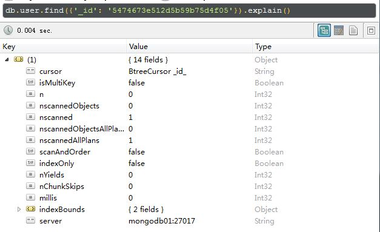

---
category: db
published: false
layout: post
title: 记录MongoDB一些优化方法
description: 整理网上收集到的和一些项目中用到的MongoDB优化策略～
---  

##    
## 1. 决定是否优化   

### 1.1 使用MongoDB自带的explain命令查看查询性能  
　　下面是我在本地测试的一个例子。    

    > db.user.find({'user':'taotao.liddd@datayes.com'}).explain()         
    {                                                                     
            "cursor" : "BasicCursor",                                     
            "isMultiKey" : false,                                         
            "n" : 1,                                                      
            "nscannedObjects" : 9,                                        
            "nscanned" : 9,                                               
            "nscannedObjectsAllPlans" : 9,                                
            "nscannedAllPlans" : 9,                                       
            "scanAndOrder" : false,                                       
            "indexOnly" : false,                                          
            "nYields" : 0,                                                
            "nChunkSkips" : 0,                                            
            "millis" : 65,                                                
            "indexBounds" : {                                             
                                                                          
            },                                                            
            "server" : "SHN1408GPVG612:27017"                             
    }                                                                

　　里面的各个字段说明：  

- cursor: 返回游标类型(BasicCursor | BtreeCursor | GeoSearchCursor | Complex Plan | multi)  
- isMultiKey：是否使用多重索引(true | false)
- n: 返回的文档数量   (number) 
- nscannedObjects：被扫描的文档数量，这个值小于或等于nscanned   (number) 
- nscanned: 被扫描的文档数量，我们应该尽量使这个值和上面提到的n的值相近    (number)  
- nscannedObjectsAllPlans：这个值表明在进行一次查询时，数据库计划扫描的文档数量 (number) 
- nscannedAllPlans：类似nscannedObjectsAllPlans  
- scanAndOrder：若为true，表示查询不能利用文档在索引里的排序来返回结果，用户需要手动对返回进行排序操作，反之(true | false)  
- indexOnly：若为true，表示查询是充分利用了现有的索引的，在设计索引的时候，应该尽量确保热点查询都利用到了已有的索引(true | false)  
- nYields：表示查询语句执行时写锁的等待时间  (ms)
- nChunkSkips：在分片的时候可以通过这个字段看分片的效果 (number) 
- millis: 耗时 (ms)    
- indexBounds: 所使用的索引 (dict of dict) 
- allPlans：
- oldPlan：
- server: mongo所在的服务器地址及端口号  

### 1.2 使用MongoDB自带的profile优化器查看查询性能  
　　MongoDB Database Profiler是一种慢查询日志功能,可以作为我们优化数据库的依据.
开启Profiling功能,有2种方式可以控制Profiling的开关盒级别。  
- 启动MonggoDB时加上 -profile= 级别即可  
- 在客户端调用db.setProfilingLevel(级别)命令来实时配置     
　　Profiler信息保存在system.profile中.我们可以通过db.getProfilingLevel()命令来获取当前的Profile级别。profile的级别有3个，分别是0、1、2，默认没有开启。  

- 0： 表示不开启  
- 1： 表示记录慢命令(默认为>100ms)
- 2： 表示记录所有命令

## 2. 优化Schema  

## 3. 查询优化  

### 3.1 建立索引  
　　首先要明确的是，mongo里会自动根据_id来创建一个唯一性索引，所以如果你是以_id为key来进行查询的话都会很快的。比如下面这个截图，nscanned为1。
  
　　database.collection.ensureIndex( { key : 1 } , { background : true } );   
　　说明：在数据库database里，对collection中的字段key建立索引，按照升序方式建立索引background参数设置为true时表示后台创建索引【建立索引略耗时】    
　　索引是一把双刃剑啊，用得好不好，全看也许需求和数据库设计了，在设计索引前最好参考参考[官方文档](http://docs.mongodb.org/manual/core/indexes-introduction/)，而且最好要有一个建索引前后的performance的一些对比，talk is cheap, show me the data.

## 4. 一些资料  

- [mongodb性能优化](http://caizi.blog.51cto.com/5234706/1542480)   

