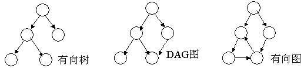

---
category: spark
published: false
layout: post
title: ［touch spark］4. spark RDD 之：什么是RDD
description: 要想学好spark，怎么能不先搞清楚RDD的来龙去脉呢～～～	
---  

##  
## 1. 什么是RDD 
　　先看下源码里是怎么描述RDD的。  
>>  
Internally, each RDD is characterized by five main properties:  
A list of partitions  
A function for computing each split   
A list of dependencies on other RDDs  
Optionally, a Partitioner for key-value RDDs (e.g. to say that the RDD is hash-partitioned)   
Optionally, a list of preferred locations to compute each split on (e.g. block locations for an HDFS file)   

　　每个RDD有5个主要的属性：  

- 一组分片（partition），即数据集的基本组成单位  
- 一个计算每个分片的函数  
- 对parent RDD的依赖，这个依赖描述了RDD之间的lineage  
- 对于key-value的RDD，一个Partitioner，这是可选择的  
- 一个列表，存储存取每个partition的preferred位置。对于一个HDFS文件来说，存储每个partition所在的块的位置。这也是可选择的  

　　把上面这5个主要的属性总结一下，可以得出RDD的大致概念。首先要知道，RDD大概是这样一种表示数据集的东西，它具有以上列出的一些属性。是spark项目组设计用来表示数据集的一种数据结构。而spark项目组为了让RDD能handle更多的问题，又规定RDD应该是只读的，分区记录的一种数据集合中。可以通过两种方式来创建RDD：一种是基于物理存储中的数据，比如说磁盘上的文件；另一种，也是大多数创建RDD的方式，即通过其他RDD来创建【以后叫做转换】而成。而正因为RDD满足了这么多特性，所以spark把RDD叫做Resilient Distributed Datasets，中文叫做弹性分布式数据集。很多文章都是先讲RDD的定义，概念，再来说RDD的特性。我觉得其实也可以倒过来，通过RDD的特性反过来理解RDD的定义和概念，通过这种由果溯因的方式来理解RDD也未尝不可。反正对我个人而言这种方式是挺好的。  

## 2. 理解RDD的几个关键概念   
　　本来我是想参考RDD的论文和自己的理解来整理这篇文章的，可是后来想想这样是不是有点过于细致了。我想，认识一个新事物，在时间、资源有限的情况下，不必锱铢必较，可以先focus on几个关键点，到后期应用的时候再步步深入。  
　　所以，按照我个人的理解，我认为想用好spark，必须要理解RDD，而为了理解RDD，我认为只要了解下面几个RDD的几个关键点就能handle很多情况下的问题了。所以，下面所有列到的点，都是在我个人看来很重要的，但也许有所欠缺，大家如果想继续深入，可以看第三部分列出的参考资料，谢谢。
　　
### 2.1 RDD的背景及解决的痛点 问题   
　　按照RDD的paper来讲，RDD的设计是为了充分利用分布式系统中的内存资源，使得提升一些特定的应用的效率。这里所谓的特定的应用没有明确定义，但可以理解为一类应用到迭代算法，图算法等的应用类型；除此之外，RDD还可以应用在交互式大数据处理方面。所以，我们这里需要明确一下：RDD并不是万能的，也不是什么带着纱巾的少女那样神奇，简单的理解，就是一群大牛为了解决一个问题设计的一个特定的数据结构，that's all。

### 2.2 What is DAG?   
　　DAG - Direct Acyclic Graph，有向五无图，好久没看图片了，先发个图片来理解理解吧。
  
　　要理解DAG，只需弄明白三个概念就可以毕业了： 

- 图： 
- 有向：
- 无环：

## 3. 参考资料  
- [Spark技术内幕：究竟什么是RDD](http://blog.csdn.net/anzhsoft/article/details/39851421)   
- [Resilient Distributed Datasets: A Fault-Tolerant Abstraction for
In-Memory Cluster Computing](http://www.cs.berkeley.edu/~matei/papers/2012/nsdi_spark.pdf)    
- [RDD 论文中文版](http://shiyanjun.cn/archives/744.html )

　　